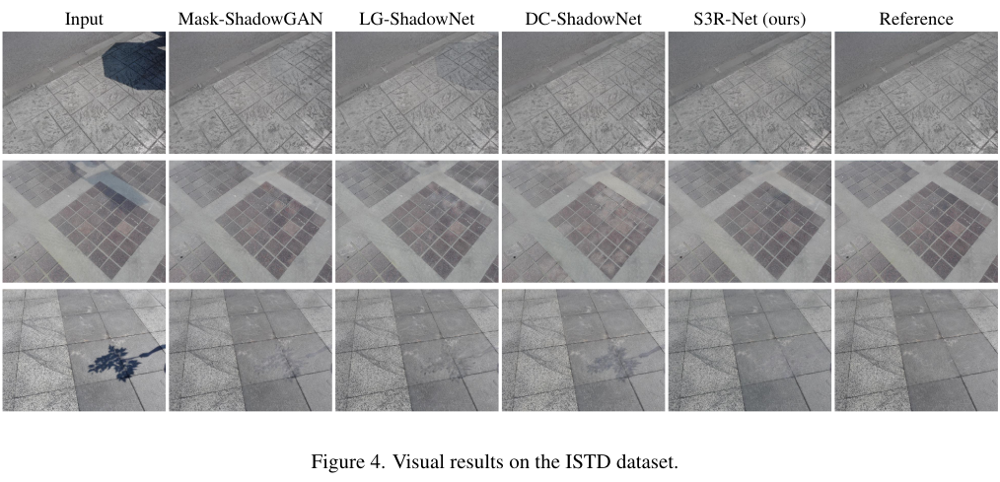

# S3R-Net: A Single-Stage Approach to Self-Supervised Shadow Removal (NTIRE @ CVPR 2024) - Kubiak _et al._


## The basics
This is the official project repo for the paper [S3R-Net: A Single-Stage Approach to Self-Supervised Shadow Removal](https://arxiv.org/pdf/2404.12103), published at the NTIRE workshop at CVPR 2024.

The model was developed in an env based on Pytorch 1.8.1 with CUDA 11.1 (docker image: nvidia/cuda:11.1.1-cudnn8-runtime-ubuntu18.04). Key project dependancies: ```kornia```, ```scikit-image```, ```wandb```.

## Testing
- Download the checkpoints ([ISTD](https://personalpages.surrey.ac.uk/s.hadfield/istd_ckpt.pth) | [AISTD](https://personalpages.surrey.ac.uk/s.hadfield/aistd_ckpt.pth)) and put them in the relevant folder, e.g. ```checkpoints/best_istd``` (you need to create the ```./checkpoints``` folder). Rename each checkpoint file to ```latest_net_G.pth```.

- Update the dataset path - ```self.image_folder``` - in ```tools/datasets/istd_paired_dataset.py``` to point towards your ISTD/AISTD dataset folder.

- To test the ISTD model, run:
  ```
  python test.py --name best_istd --dataset istd
  ```
  For AISTD, replace ```istd``` with ```aistd``` in the checkpoint & dataset names.

## Training
- Update the dataset path  - ```self.image_folder``` - in ```tools/datasets/istd_paired_dataset.py``` to point towards your ISTD/AISTD dataset folder. Alternatively, create your own dataset in ```tools/datasets/<YOUR DATASET>```, add it to ```tools/dataloader.py``` and use the flag ```--dataset <YOUR DATASET>```.

- To train the model, use the below command:
  ```
  python train.py --name <YOUR EXP NAME> --dataset <YOUR DATASET>/istd/aistd
  ```
- To enable wandb logging, use the ```--tb_log 1``` flag; you'll also need to create a ```./logs``` folder. For other training parameters, please refer to ```tools/args.py```.
- To evaluate, follow the instruction from **Testing**. To test a model version other than the default ```latest```, use the ```--which <EPOCH NUMBER>``` flag. 

## Citation
If you use or write about S3R-Net, please use the below citation:
```
@inproceedings{kubiak_2024_s3rnet,
  title={S3R-Net: A Single-Stage Approach to Self-Supervised Shadow Removal},
  author={Nikolina Kubiak and Armin Mustafa and Graeme Phillipson and Stephen Jolly and Simon Hadfield},
  booktitle={Proceedings of the IEEE/CVF Conference on Computer Vision and Pattern Recognition Workshops (CVPRW)},
  year={2024}
}
```
## Acknowledgements
This project builds upon [pix2pixHD](https://github.com/NVIDIA/pix2pixHD/tree/master) and our previous project - [SILT](https://github.com/n-kubiak/SILT).
